# Image Processor — Arquitectura Serverless en AWS

Pipeline serverless para subir imágenes y recortarlas automáticamente a **40×40 px circular PNG**.  
Desplegado con AWS SAM en 3 entornos independientes: **DEV**, **QA** y **PROD**.

---

## Tabla de contenidos

1. [Arquitectura](#arquitectura)
2. [Requisitos previos](#requisitos-previos)
3. [Cómo clonar el repositorio](#cómo-clonar-el-repositorio)
4. [Estructura del proyecto](#estructura-del-proyecto)
5. [Cómo desplegar](#cómo-desplegar)
6. [Cómo usar el frontend](#cómo-usar-el-frontend)
7. [Verificar el flujo en AWS](#verificar-el-flujo-en-aws)
8. [Cómo destruir los recursos](#cómo-destruir-los-recursos)
9. [Evidencia de despliegue](#evidencia-de-despliegue)

---

## Arquitectura

```
Cliente (browser)
    │  POST /upload  multipart/form-data
    ▼
API Gateway HTTP API v2  (HTTPS · CORS · throttling 1 000 rps)
    │
    ▼
UploadFunction — Lambda Node 20 · 256 MB · 30 s
    │  s3:PutObject via S3 Gateway Endpoint (tráfico privado)
    ▼
S3 Bucket  →  uploads/<uuid>.<ext>
    │  S3 Event Notification ObjectCreated
    ▼
SQS Queue  (visibility 360 s · long polling 20 s · DLQ tras 3 fallos)
    │  Event Source Mapping · batch 5 · ReportBatchItemFailures
    ▼
CropFunction — Lambda Node 20 · 512 MB · 60 s
    │  sharp: resize 40x40 cover + SVG circle mask → PNG transparente
    ▼
S3 Bucket  →  processed/<uuid>.png
```

### Recursos de infraestructura (template.yaml)

| Recurso | Descripción |
|---------|-------------|
| VPC 10.0.0.0/16 | DNS habilitado, 2 zonas de disponibilidad |
| Public Subnets A/B | 10.0.1.0/24 y 10.0.2.0/24 — NAT Gateways |
| Private Subnets A/B | 10.0.11.0/24 y 10.0.12.0/24 — Lambdas |
| NAT Gateway A/B | Alta disponibilidad por AZ |
| S3 Gateway Endpoint | Tráfico S3 sin salir a internet, sin costo |
| SQS Interface Endpoint | Tráfico SQS sin salir a internet |
| ImageDLQ | Dead Letter Queue, retención 14 días |
| ImageQueue | Cola principal, retención 1 día |
| ImageBucket | Versionado, cifrado AES-256, acceso privado |
| API Gateway HTTP v2 | CORS habilitado, access logs, throttling |
| UploadFunction | Recibe multipart y guarda en S3 |
| CropFunction | Recorta a 40x40 circular PNG |
| CloudWatch Alarm | Alerta si hay mensajes en la DLQ |

---

## Requisitos previos

### 1. AWS CLI instalado y configurado

```bash
# Verificar instalación
aws --version
# Salida esperada: aws-cli/2.x.x Python/3.x ...

# Configurar credenciales
aws configure
# Ingresa:
#   AWS Access Key ID:     <...>
#   AWS Secret Access Key: <...>
#   Default region name:   us-east-2
#   Default output format: json
```

### 2. AWS SAM CLI

```bash
# Verificar instalación
sam --version
# Salida esperada: SAM CLI, version 1.x.x
```

### 3. Node.js 20

```bash
node --version
# Salida esperada: v20.x.x
```

---

## Cómo clonar el repositorio

```bash
# 1. Clona el repositorio
git clone https://github.com/Wilmer2003/aws-lambda.git

# 2. Entra a la carpeta del proyecto
cd aws-lambda

# 3. Instala las dependencias de cada función Lambda
cd src/upload && npm install && cd ../..
cd src/crop   && npm install && cd ../..
```

---

## Estructura del proyecto

```
aws-lambda-image-processor/
├── template.yaml          # Infraestructura completa (SAM + CloudFormation)
├── samconfig.toml         # Configuración de deploy por entorno
├── README.md              
│
├── src/
│   ├── upload/
│   │   ├── app.js         # Lambda: recibe multipart, guarda en S3 uploads/
│   │   └── package.json
│   │
│   └── crop/
│       ├── app.js         # Lambda: consume SQS, recorta a 40x40 PNG circular
│       └── package.json
│
└── frontend/
    └── index.html         # Panel web para probar el endpoint
```

---

## Cómo desplegar

### Paso 1 — Build

Ejecuta siempre antes de cualquier deploy:

```bash
sam build
```

### Paso 2 — Deploy DEV

```bash
sam deploy --config-env dev
```

### Paso 3 — Deploy QA

```bash
sam deploy --config-env qa
```

### Paso 4 — Deploy PROD

```bash
sam deploy --config-env prod
```

### Outputs del deploy

Al finalizar cada deploy aparecerá una tabla como esta:

```
Key         ApiEndpoint
Value       https://xxxx.execute-api.us-east-2.amazonaws.com/dev/upload

Key         BucketName
Value       img-proc-dev-507744946112-us-east-2

Key         QueueUrl
Value       https://sqs.us-east-2.amazonaws.com/507744946112/image-processor-dev-queue

Key         DLQUrl
Value       https://sqs.us-east-2.amazonaws.com/507744946112/image-processor-dev-dlq
```

---

## Cómo usar el frontend

1. Abre `frontend/index.html` en el navegador.
2. Selecciona el entorno **DEV**, **QA** o **PROD** en el panel izquierdo.
3. Pega el `ApiEndpoint` del output de `sam deploy` en el campo **API Endpoint**.
4. Arrastra una imagen (jpg, png) o haz clic en el botón de seleccionar archivo.
5. Haz clic en **Enviar al pipeline**.
6. Si todo funciona verás `[OK]` en el log con la clave S3 del archivo guardado.

---

## Verificar el flujo en AWS

### Ver los 3 stacks en CloudFormation

1. Consola AWS → **CloudFormation**
2. Deben aparecer los 3 stacks en estado **CREATE_COMPLETE**:
   - `image-processor-dev`
   - `image-processor-qa`
   - `image-processor-prod`

### Ver las imágenes en S3

```bash
# Imágenes originales subidas (DEV)
aws s3 ls s3://img-proc-dev-<ACCOUNT_ID>-us-east-2/uploads/ --region us-east-2

# Imágenes procesadas 40x40 PNG (DEV)
aws s3 ls s3://img-proc-dev-<ACCOUNT_ID>-us-east-2/processed/ --region us-east-2

# Descargar una imagen procesada
aws s3 cp s3://img-proc-dev-<ACCOUNT_ID>-us-east-2/processed/<archivo>.png ./resultado.png --region us-east-2
```

### Ver logs de las Lambdas en tiempo real

```bash
# Logs de UploadFunction
aws logs tail /aws/lambda/image-processor-dev-upload --follow --region us-east-2

# Logs de CropFunction
aws logs tail /aws/lambda/image-processor-dev-crop --follow --region us-east-2
```

---

## Cómo destruir los recursos

> AWS no elimina buckets S3 con archivos — hay que vaciarlos primero.

### Paso 1 — Vaciar los buckets S3

```bash
# DEV
aws s3 rm s3://img-proc-dev-<ACCOUNT_ID>-us-east-2 --recursive --region us-east-2

# QA
aws s3 rm s3://img-proc-qa-<ACCOUNT_ID>-us-east-2 --recursive --region us-east-2

# PROD
aws s3 rm s3://img-proc-prod-<ACCOUNT_ID>-us-east-2 --recursive --region us-east-2
```

### Paso 2 — Eliminar los stacks

```bash
aws cloudformation delete-stack --stack-name image-processor-dev --region us-east-2
aws cloudformation delete-stack --stack-name image-processor-qa --region us-east-2
aws cloudformation delete-stack --stack-name image-processor-prod --region us-east-2
```
---

## Evidencia de despliegue

### 1. — Los 3 stacks activos en CloudFormation

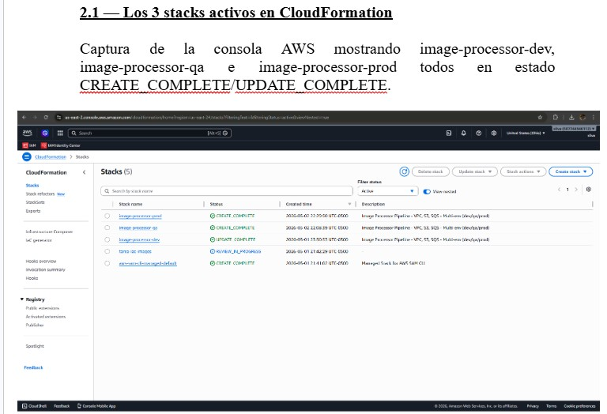

---

### 2.— Outputs del stack DEV 

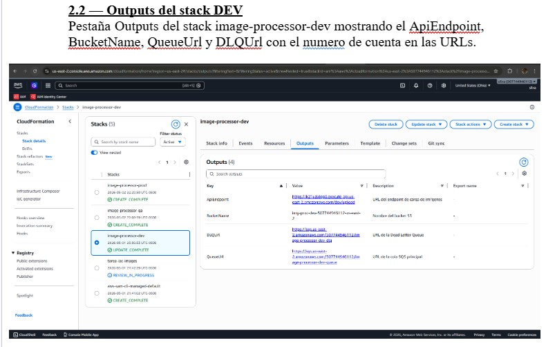

---

### 3. — Outputs del stack QA

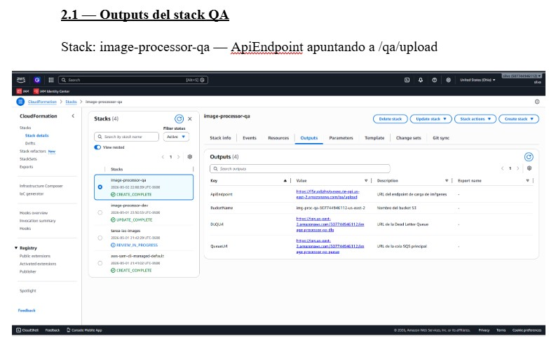

---

### 4. — Outputs del stack PROD

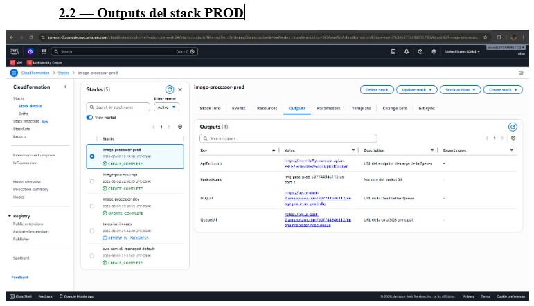

---
### 5. Evidencia del flujo funcionando 
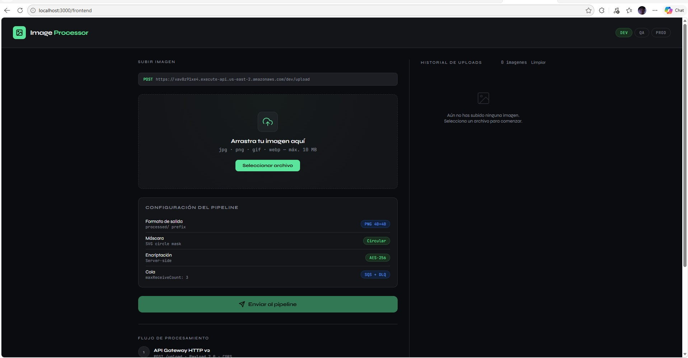

---
### 6. Carpetas dentro de amazon S3
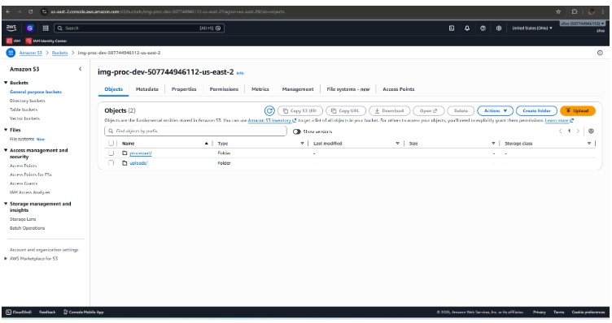
 
---
### 7. Carpeta uploads en S3
Imágenes originales guardadas bajo `uploads/` en el bucket de DEV.

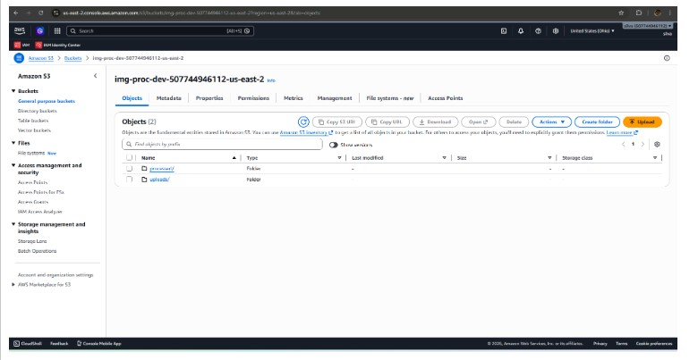


Imagen original

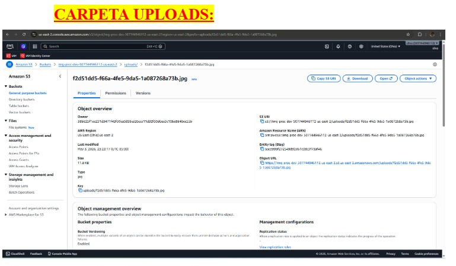

---
### 7. Carpeta processed en S3

Imágenes originales guardadas bajo `processed/` en el bucket de DEV.

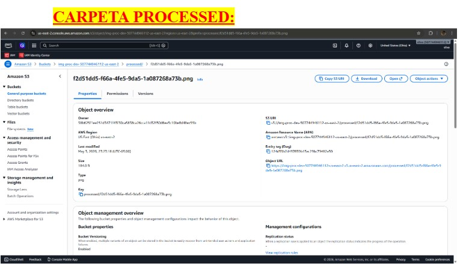


Imagen procesada

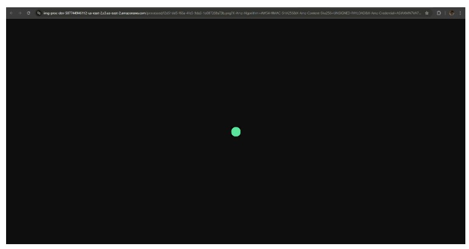

---

### 8. Logs en CloudWatch

Ejecuciones de `CropFunction` en CloudWatch.

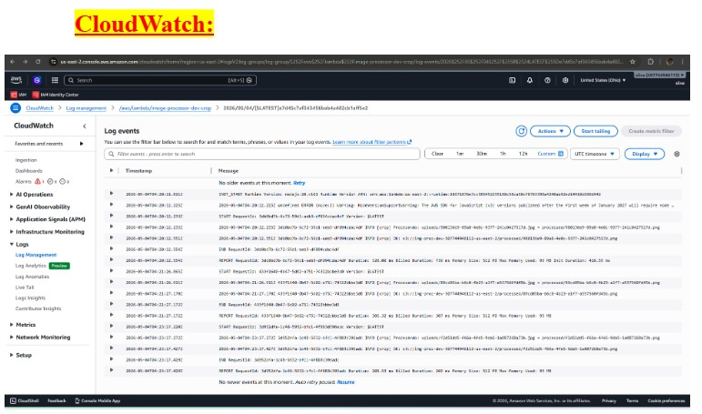

---

### 9. Recursos destruidos, stack eliminados en cloudformation

Los 3 stacks en estado `DELETE_COMPLETE` confirmando que todos los recursos fueron eliminados.

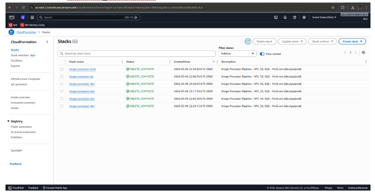
